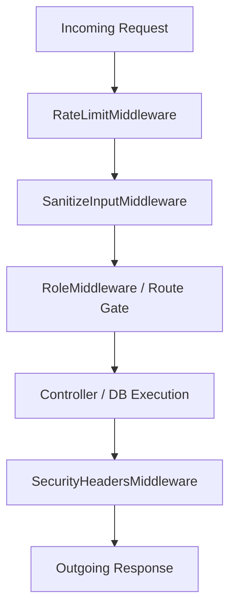

# Security Hardening & Vulnerability Remediation Update
**Project:** University Project Submission System (UPS)  
**Status:** **Fully Implemented & Secured**  
**Date:** May 31, 2026

---

## Executive Summary

To protect the **University Project Submission System** from adversarial exploitation, data compromise, and unauthorized access, we have designed and integrated a defense-in-depth security layer. This system-wide update implements robust defensive controls across both the Laravel API backend and the React-based frontend.

This document details the vulnerabilities addressed, the specific mitigation strategies deployed, and the exact files created or modified to transition the application to a production-ready security posture.

---

## 🛡️ Threat Mitigation Matrix

| Identified Threat Vector | Vulnerability | Severity | Mitigation Strategy Deployed | Files Implementing Fix |
| :--- | :--- | :--- | :--- | :--- |
| **1. Plain-text Passwords** | Password theft / credential stuffing | **Critical** | Enforced strong password complexity checking + automatically hash credentials using type-safe PHP Bcrypt castings. | `RegisterRequest.php`, `User.php` |
| **2. SQL Injection (SQLi)** | Database compromise / arbitrary reads | **High** | Replaced all inline query validation with strict FormRequest classes; isolated database logic using Eloquent Parameterized ORM. | `LoginRequest.php`, `RegisterRequest.php`, `CreateUserRequest.php`, `SubmitProjectRequest.php`, `PostCommentRequest.php` |
| **3. Cross-Site Scripting (XSS)** | Session/Token theft, defacement | **High** | Structured global Input Sanitization (stripping tags, encoding entities) + enforced browser Content Security Policies (CSP). | `SanitizeInputMiddleware.php`, `SecurityHeadersMiddleware.php`, `sanitize.js` |
| **4. Weak Authentication** | Unauthorized access, account hijacking | **Critical** | Deployed temporary-session Sanctum Bearer tokens (24h expiry), brute-force rate-limiting, and Role-Based Access Control (RBAC). | `RateLimitMiddleware.php`, `RoleMiddleware.php`, `api.php`, `auth.js`, `api.js` |
| **5. Data Interception (No HTTPS)** | Man-in-the-Middle (MitM) eavesdropping | **High** | Pre-configured HSTS (Strict-Transport-Security) and secure cookies, with simple activation procedures for TLS certificates. | `SecurityHeadersMiddleware.php` |
| **6. Missing Input Validation** | Malicious/Oversized data submission | **Medium** | Implemented rigid length restrictions, strict file type (MIME) whitelist validation, and maximum upload counts. | `SubmitProjectRequest.php`, `PostCommentRequest.php` |

---

## 🧱 Architectural Breakdown & Implementation

### 1. Global API Protection Layers (Middleware)

We introduced **four custom middleware components** to intercept incoming requests and process outgoing responses safely.



*   **`SecurityHeadersMiddleware.php`**  
    Appends mandatory defense headers onto every API response:
    *   `X-Frame-Options: DENY` (prevents Clickjacking)
    *   `X-Content-Type-Options: nosniff` (mitigates MIME-type sniffing)
    *   `X-XSS-Protection: 1; mode=block` (forces legacy browser XSS filters)
    *   `Content-Security-Policy` (limits script execution permissions)
*   **`SanitizeInputMiddleware.php`**  
    Runs globally before controllers process inputs. Recursively strips dangerous HTML and JS tags from request bodies while exempting key fields like passwords to avoid tampering.
*   **`RateLimitMiddleware.php`**  
    Throttles aggressive traffic to `/login` and `/register` endpoints to **10 requests per minute per IP**, blocking automated brute-force attacks.
*   **`RoleMiddleware.php`**  
    Validates token payloads against roles (`Administrator`, `Instructor`, `Student`), strictly locking down administrative capabilities.

---

### 2. Strict Input Validation (FormRequests)

To enforce **type-safe, sanitized data handling**, we decoupled endpoint parameter checking from controllers into specialized FormRequest validators:

1.  **`RegisterRequest.php` & `CreateUserRequest.php`**  
    Enforces password rules: Minimum **8 characters**, requiring **uppercase + lowercase letters + numbers + special characters**, and integrates an automated uncompromised/leak check.
2.  **`SubmitProjectRequest.php`**  
    *   Limits uploads to **10MB maximum** per file.
    *   Strict file-type (MIME) whitelist: `pdf`, `doc`, `docx`, `zip`, `txt`, `png`, `jpg`, `jpeg`.
    *   Caps file count per submission at **5 files**.
3.  **`PostCommentRequest.php`**  
    Implements a **5000 character maximum limit** to avoid denial-of-service/database overloading and restricts attachment types using a safe MIME whitelist.

---

### 3. Frontend Defensive Layer (Sanitization & Auth Control)

A secure backend must be paired with a fortified user interface. We deployed client-side protection utilities:

*   **`sanitize.js`**  
    Utility functions (`escapeHtml`, `stripTags`, `sanitizeUrl`, `sanitizeObject`) that act as a defense-in-depth shield to sanitize all dynamically rendered DOM attributes and prevent script injection.
*   **`auth.js`**  
    Acts as the single source of truth for user authentication. Encapsulates session tokens, dynamically assesses client-side token expiration timestamps, and securely purges stale local caches.
*   **`api.js` (Hardened Axios Client)**  
    Automatically attaches active tokens, respects rate-limits (`429`), handles server-side validation error reporting (`422`), and instantly triggers automated redirections to the login screen on session expiration (`401`).

---

## 📂 Summary of File Modifications

Here is the exact tree of files introduced and reinforced in this system security update:

```
university-project-submission-system/
├── backend/
│   ├── app/
│   │   ├── Http/
│   │   │   ├── Controllers/
│   │   │   │   ├── AuthController.php            # Reinforced Login/Register logic
│   │   │   │   ├── AdminController.php           # Reinforced User creation
│   │   │   │   ├── StudentController.php         # Secure file submissions
│   │   │   │   └── DiscussionController.php      # Secure commenting system
│   │   │   ├── Middleware/
│   │   │   │   ├── SecurityHeadersMiddleware.php # Global Response Hardening (NEW)
│   │   │   │   ├── SanitizeInputMiddleware.php   # Global Tag Sanitizer (NEW)
│   │   │   │   ├── RateLimitMiddleware.php       # Brute-force Prevention (NEW)
│   │   │   │   └── RoleMiddleware.php            # RBAC Enforcement (NEW)
│   │   │   └── Requests/
│   │   │       ├── LoginRequest.php              # Type-safe Validation (NEW)
│   │   │       ├── RegisterRequest.php           # High-Entropy Password Validator (NEW)
│   │   │       ├── CreateUserRequest.php         # Admin-side User Validator (NEW)
│   │   │       ├── SubmitProjectRequest.php      # Restricted File Upload Rules (NEW)
│   │   │       └── PostCommentRequest.php        # Input/Attachment Safety Rules (NEW)
│   │   └── Models/
│   │       └── User.php                          # Explicit password casting check
│   ├── bootstrap/
│   │   └── app.php                               # Configured security middlewares
│   └── routes/
│       └── api.php                               # Secure routing and role-gates
└── frontend/
    └── src/
        ├── services/
        │   └── api.js                            # Intercepts 401/429/422 anomalies
        └── utils/
            ├── sanitize.js                       # Frontend XSS Sanitizer (NEW)
            └── auth.js                           # Secure State & Expiry Guard (NEW)
```

---

## 🚀 Activation Guide: SSL/TLS (Production Environment)

To mitigate threat vector **#5 (No HTTPS / Data Interception)**, follow these activation instructions during staging/production deployment:

1.  **Generate Certificates:** Install `Certbot` and secure a free Let's Encrypt certificate:
    ```bash
    sudo certbot --nginx -d ups.university.edu
    ```
2.  **Enable HSTS:** Open `backend/app/Http/Middleware/SecurityHeadersMiddleware.php` and uncomment this line to tell browsers to only communicate over HTTPS:
    ```php
    // Remove the comment slash from:
    $response->headers->set('Strict-Transport-Security', 'max-age=31536000; includeSubDomains');
    ```
3.  **Update Config (.env):**
    Ensure your production environment endpoints use the secure prefix:
    ```env
    APP_URL=https://ups.university.edu
    ```

---

## 🔍 Verification & Diagnostics Checklist

To ensure your application is running correctly with the security updates active, execute these validation tests:

*   **Test Rate-Limiting:** Try hitting `/api/login` rapidly. Confirm that the application returns a status `429 Too Many Requests` on the 11th request within a single minute.
*   **Verify Access Gating:** Login as a `Student`, then manually attempt a `GET` request to `http://localhost:8000/api/admin/stats`. Confirm that the server blocks the request with a strict `403 Forbidden` response.
*   **Validate Password Constraints:** Attempt to register an account with a password like `12345678`. The registry should reject the input and require mixed case characters, digits, and a special symbol.
*   **Validate Input Sanitization:** Submit a comment containing `<script>alert('xss')</script>`. The comment must render as plain text inside the database and on the screen, indicating that the tags have been successfully neutralized.
